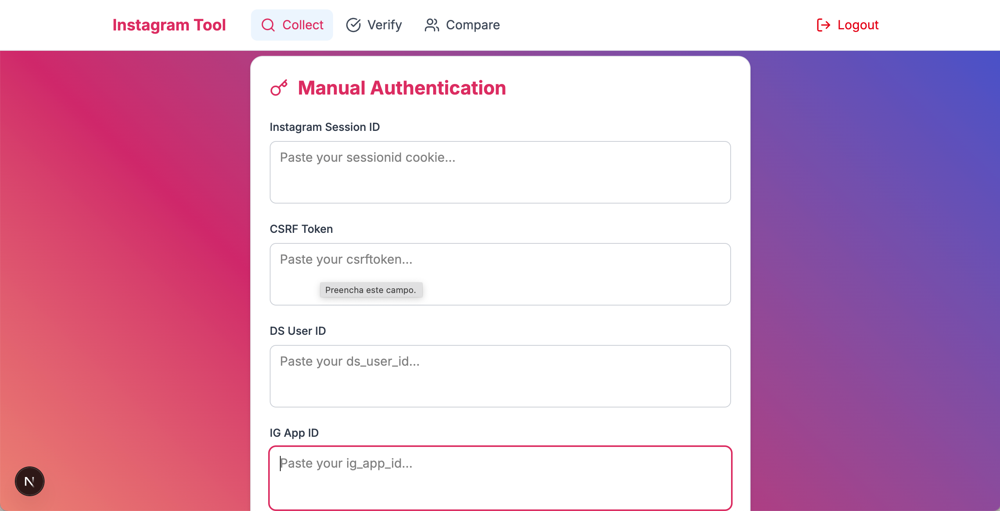
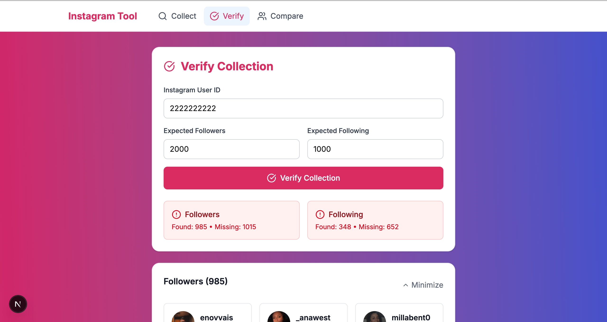
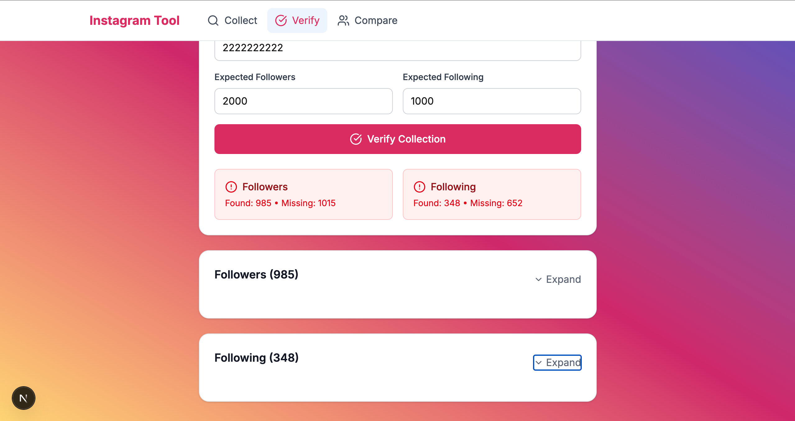
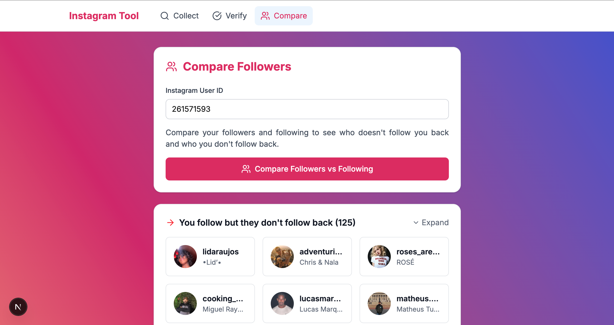
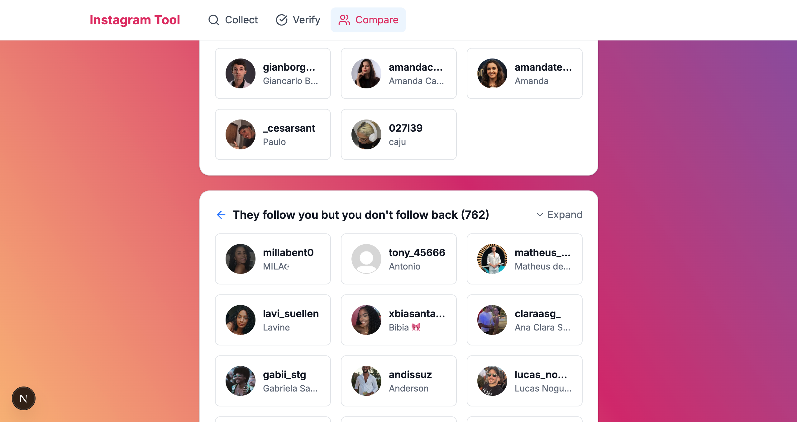

# 📌 Instagram Scraper Web

Interface web para **coletar**, **verificar** e **comparar** seguidores e seguindo do Instagram, usando cookies manuais e scraping controlado.

---

## 🚦 Fluxo de Uso

1️⃣ **Autenticação manual**  
2️⃣ **Coleta de seguidores/seguindo**  
3️⃣ **Verificação dos dados salvos**  
4️⃣ **Comparação de quem não segue de volta**

---

## 📃 Páginas principais

### ✅ 1. **Collection Page**

- 📍 **URL:** `/collection`
- 🗝️ **Função:** Digite e salve manualmente os **cookies de sessão** (`sessionid`, `csrftoken`, `ds_user_id`, `ig_app_id`).
- 🗂️ **Depois:** Digite o **User ID** do Instagram e marque **Followers**, **Following**, ou ambos.
- ⏳ **Botão:** Inicia a coleta. Mostra progresso simulado.




---

### ✅ 2. **Verify Page**

- 📍 **URL:** `/verify`
- 🧹 **Função:** Verifica se os arquivos **JSON locais** foram criados corretamente.
- 🔢 **Extras:** Confirme o número de seguidores/seguindo esperados.
- ✅ **Resultado:** Mostra quantos registros foram coletados e possíveis diferenças.




---

### ✅ 3. **Compare Page**

- 📍 **URL:** `/compare`
- 🔍 **Função:** Compara os arquivos salvos para exibir:
  - Quem **você segue mas não te segue**
  - Quem **te segue mas você não segue**
- 🗃️ **Filtro:** Mostra lista com opção de expandir/minimizar.




---

## ⚙️ Como rodar o projeto

```bash
# Instalar dependências
npm install

# Rodar em dev
npm run dev
```

---

## ⚠️ Requisitos

- O **servidor backend** (`instagram-scraper-server`) deve estar rodando:
  ```bash
  node ace server --watch
  ```
- As requisições dependem da porta e rotas do backend.

---

## 🧩 Organização

- `CollectionPage` → Autentica e coleta.
- `VerifyPage` → Verifica e mostra diferenças.
- `ComparePage` → Lista quem segue/quem não segue.

---

## 📚 Leia mais

👉 Para detalhes do backend: [README do Server](../instagram-scraper-server/README.md)

---

🫶 **Feito para estudos e experimentos controlados. Use com moderação!**
