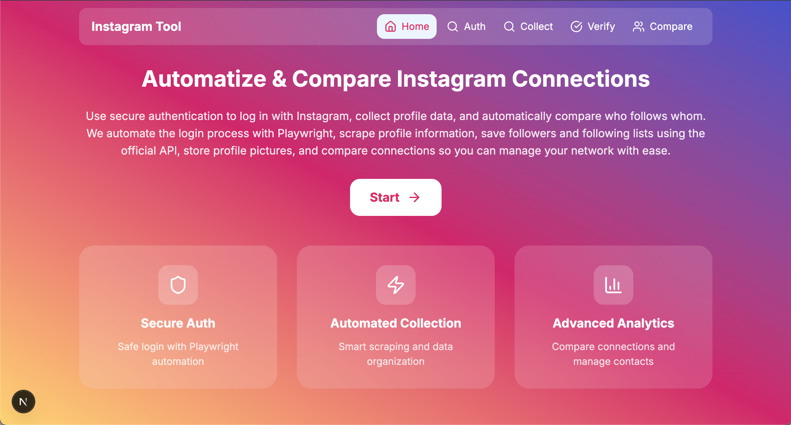
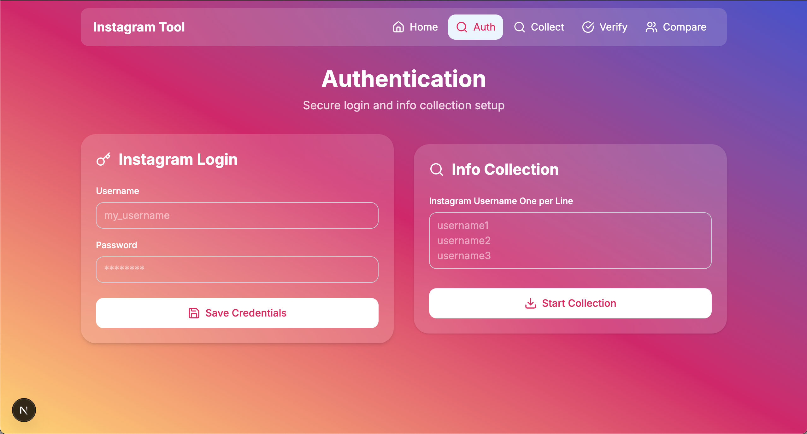
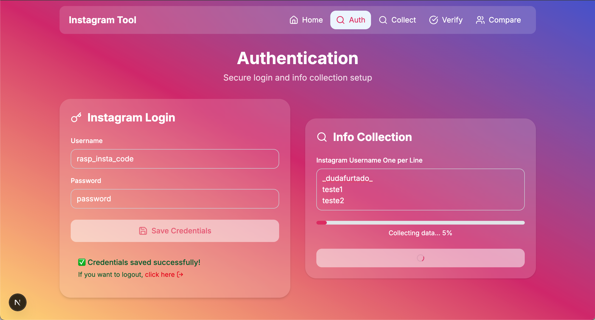
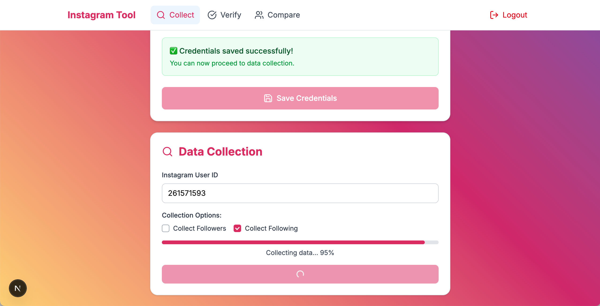
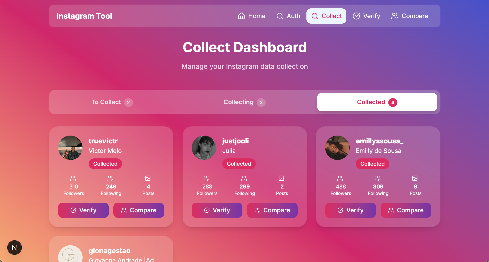

# 📌 Instagram Scraper Web

Interface web para **coletar**, **verificar** e **comparar** seguidores e seguindo do Instagram, usando automação e scraping controlados.

## 🎨 UI Instagram

> Referências da identidade visual do Instagram.

- [📌 Identidade da Marca](https://about.instagram.com/pt-br/brand/)
- [📐 Layout](https://about.instagram.com/pt-br/brand/layout)
- [🔤 Font Type](https://about.instagram.com/pt-br/brand/type)
- [🌈 Gradiente](https://about.instagram.com/pt-br/brand/gradient)
- [🌈 Gradiente 2](https://gradient.page/ui-gradients/instagram)

---

### 🎨 **Paleta**

| Nome            | HEX       |
| --------------- | --------- |
| Amarelo         | `#FFD600` |
| Laranja         | `#FF7A00` |
| Rosa            | `#FF0069` |
| Lilás / Magenta | `#D300C5` |
| Roxo            | `#7638FA` |

---

### 🌈 **Gradientes**

#### **Amarelo → Laranja → Rosa**

```css
bg-gradient-to-tr from-[#FFD600] via-[#FF7A00] to-[#FF0069]
```

#### **Rosa → Lilás → Roxo**

```css
bg-gradient-to-tr from-[#FF0069] via-[#D300C5] to-[#7638FA]
```

---

### ✨ **Gradientes com Opacidade e Blur**

#### 🔆 Amarelo → Laranja → Rosa (80% Opacidade + Blur)

```css
bg-gradient-to-tr from-[#FFD600]/80 via-[#FF7A00]/80 to-[#FF0069]/80 backdrop-blur-xl
```

#### 🔆 Rosa → Lilás → Roxo (80% Opacidade + Blur)

```css
bg-gradient-to-tr from-[#FF0069]/80 via-[#D300C5]/80 to-[#7638FA]/80 backdrop-blur-xl
```

---

## 📌 **Outras Cores Utilizadas**

| Nome             | HEX       | RGB            |
| ---------------- | --------- | -------------- |
| Vermelho Violeta | `#bc2a8d` | `188, 42, 141` |
| Amarelo          | `#fccc63` | `252, 204, 99` |
| Laranja          | `#fbad50` | `251, 173, 80` |
| Rosinha Salmão   | `#dc6c6f` | —              |

---

### ✅ **Gradiente Extra**

#### 🔸 **Degradê Personalizado**

```css
bg-gradient-to-tr from-[#fbad50] to-[#bc2a8d]
```

---

> 📌 **Obs:** Eu não segui as cores oficiais.

## 🚦 Fluxo de Uso

1️⃣ **Autenticação no Instagram**  
2️⃣ **Raspagem de dados do perfil**  
3️⃣ **Coleta de seguidores/seguindo**  
4️⃣ **Comparação de quem não segue de volta**

---

## 📃 Páginas

### 1. **Home Page**

- 📍 **URL:** `/`
- 🗝️ **Função:** Contextualizar o projeto e descrever funções.
- ⏳ **Botão:** Envia o usuário para a autenticação.



### 2. **Auth Page**

- 📍 **URL:** `/auth`
- 🗝️ **Função:** Digite o usuário e senha para fazer login com a automação.
- 🗂️ **Depois:** Digite o **Username** do Instagram interessado em analisar. É permitido escrever um nome por linha.
- ⏳ **Botão:** Inicia a coleta de informações básicas. Mostra progresso simulado. Uma aba do navegador é aberta mostrando o processo da automação.




### 3. **Collect Page**

- 📍 **URL:** `/collect`
- 🗝️ **Função:** Digite e salve manualmente os **cookies de sessão** (`sessionid`, `csrftoken`, `ds_user_id`, `ig_app_id`).
- 🗂️ **Depois:** Digite o **User ID** do Instagram e marque **Followers**, **Following**, ou ambos.
- ⏳ **Botão:** Inicia a coleta. Mostra progresso simulado.





---

### ✅ 4. **Verify Page**

- 📍 **URL:** `/verify`
- 🧹 **Função:** Verifica se os arquivos **JSON locais** foram criados corretamente.
- 🔢 **Extras:** Confirme o número de seguidores/seguindo esperados.
- ✅ **Resultado:** Mostra quantos registros foram coletados e possíveis diferenças.


---

### ✅ 5. **Compare Page**

- 📍 **URL:** `/compare`
- 🔍 **Função:** Compara os arquivos salvos para exibir:
  - Quem **você segue mas não te segue**
  - Quem **te segue mas você não segue**
- 🗃️ **Filtro:** Mostra lista com opção de expandir/minimizar.


---

## ⚙️ Como rodar o projeto

```bash
# Instalar dependências
npm install

# Rodar em dev
npm run dev
```

---

## ⚠️ Requisitos

- O **servidor backend** (`instagram-scraper-server`) deve estar rodando:
  ```bash
  node ace server --watch
  ```
- As requisições dependem da porta e rotas do backend.

---

## 🧩 Organização

- `CollectionPage` → Autentica e coleta.
- `VerifyPage` → Verifica e mostra diferenças.
- `ComparePage` → Lista quem segue/quem não segue.

---

## 📚 Leia mais

👉 Para detalhes do backend: [README do Server](../instagram-scraper-server/README.md)

---

🫶 **Feito para estudos e experimentos controlados. Use com moderação!**
